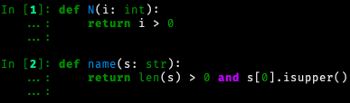
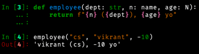
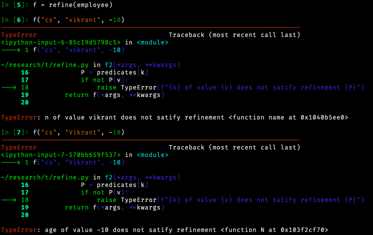
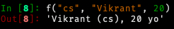

# Refinement types and Dependent types to python

This repository consists of my experiments on adding
refinement types and predicate types to python.

## Refining function call args

I make use of type hints added in Python 3.5 to
retrofit refinement types to python.

Define predicates as functions which return boolean values

Define a function with type hints pointing to the predicate functions

The function works without validation of the types. Let's refine
it using the refine function (or decorator)

Now this ain't gonna work unless all the predicates are satisfied.

Let's pass satisfactory arguments to the function.

## Issues

- Predicate functions should be without side effects in my opinion
- Refinement of variables

